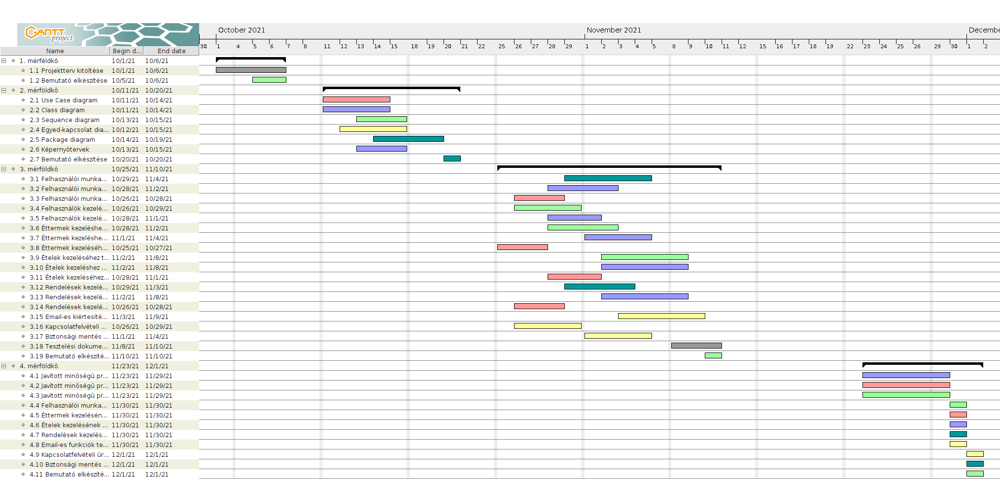

# Ételkiszállítás Projektterv 2021

## 1. Összefoglaló

Az alkalmazás lényege, hogy a vásárló tudjon felhasználói fiókot létrehozni, éttermeket keresni és onnan ételt rendelni. 
Az adminok új éttermeket tudnak hozzáadni valamint eltávolítani. Az éttermek meg tudják tekinteni az étlapjukat és azt tudják szerkeszteni.
Valamint a rendelést követően az étterem és a vásárló is kap egy e-mail értesítést.

## 2. Verziók

| Verzió | Szerző(k)                | Dátum        | Státusz         | Megjegyzés                                                    |
|--------|--------------------------|--------------|-----------------|---------------------------------------------------------------|
| 0.1.0  | Kiss Máté Botond, Bertalan Krisztián, Hódi Ákos, Mándoki József, Tolnai József | 2021.10.14 | Kész | Projektterv          |
| 0.2.0  | Kiss Máté Botond, Bertalan Krisztián, Hódi Ákos, Mándoki József, Tolnai József |            | Folyamatban | UML és adabázis tervek |

Státusz osztályozás:
 - Tervezet: befejezetlen dokumentum, a mérföldkő leadása előtti napokban
 - Előterjesztés: a projekt menedzser bírálatával, a mérföldkő határidejekor
 - Elfogadott: a megrendelő által elfogadva, a prezentáció bemutatásakor

A leadott projekttervet véglegesnek kell tekinteni.
Mindazonáltal indokolt esetben ettől el lehet térni, amennyiben a gyakorlatvezető engedélyezi.
A fő változtatásokat itt kell vezetni a projekt teljes ideje alatt (jelenlegi példánkban most lett vége a 2. mérföldkőnek).
Általánosságban elmondható, hogy az első 2 mérföldkő során gyakoribb a változtatás, így legalább
3 fő verziót érdemes megjelölni (Tervezet-Előterjesztés-Elfogadott).
A verzió számozásának következetesnek kell lennie. A szerzőknél azoknak a nevét kell felsorolni, akik hozzájárultak a fő verzióhoz,
azaz nem feltétlen mindenki, aki módosította a dokumentumot pl. egy elírás javításával.

## 3. A projekt bemutatása

Ez a projektterv a Ételkiszállítás projektet mutatja be, mely 2021-09-20-től 2021-11-27-ig tart. A projekt célja, hogy online el tudjuk érni Szeged éttermeit és innen tudjanak rendelni a felhasználók. Mindezért egy egyszerűen használható, átlátható és hatékonyan működő webalkalmazás fog felelni.
A projekten hat fő fejlesztő fog dolgozni, az elvégzett feladatokat pedig négy alkalommal fogjuk prezentálni a megrendelőnek.

### 3.1. Rendszerspecifikáció

A rendszernek képesnek kell lennie arra, hogy a vásárló éttermek közül választhasson, ételeket rendelhessen és láthassa azok árait, értékeléseit. 
A vásárló aktuális és korábbi rendeléseit ki tudjuk listázni. 
Minden funkció a megfelelő felhasználói jogosultság mellett használható, annak függvényében írható, olvasható vagy nem megtekinthető az adat.

### 3.2. Funkcionális követelmények

- Felhasználói munkamenet megvalósítása több jogosultsági szinttel (admin, étterem, vásárló)
 - Felhasználók kezelése (CRUD)
 - Éttermek kezelése (CRUD)
 - Ételek kezelése (CRUD)
 - Vásárlások / kiszállítások kezelése (CRUD)
 - Email-es kiértesítés új rendelés esetén az adott vásárlónak és étteremnek
 - Kapcsolatfelvételi űrlap biztosítása új cégek számára
 - Biztonsági mentés automatikus létrehozása

### 3.3. Nem funkcionális követelmények

- A kliens oldal platform- és böngészőfüggetlen legyen
 - Reszponzív megjelenés
 - Szenzitív adatokat biztonságosan tároljuk
 - A legfrissebb technológiákat használja a rendszer

## 4. Költség- és erőforrás-szükségletek

Az erőforrásigényünk összesen kb. 22 személynap/fő.

A rendelkezésünkre áll összesen 420 pont.

## 5. Szervezeti felépítés és felelősségmegosztás
A projekt megrendelője Márkus András. Az Ételkiszállítás projektet a projektcsapat fogja végrehajtani, amely jelenleg hat fejlesztőből áll. A csapat pályakezdő programozókból áll.
 - Kiss Máté Botond (1 év tapasztalat)
 - Bertalan Krisztián (1 év tapasztalat)
 - Hódi Ákos (1 év tapasztalat)
 - Mándoki József (<1 év tapasztalat)
 - Tolnai József (<1 év tapasztalat)

### 5.1 Projektcsapat
A projekt a következő emberekből áll:

|                                                                                                                   | Név               | E-mail cím (stud-os)       |
|-------------------------------------------------------------------------------------------------------------------|-------------------|----------------------------|
| Megrendelő                                                                                                        | Márkus András     | markusa@inf.u-szeged.hu    |
| Felelősségek: Projekt menedzser, A rendszer működési logikája, Prezentációk                                       | Kiss Máté Botond  | h877320@stud.u-szeged.hu   |
| Felelősségek: Felhasználói Felületek (GUIk), Képernyőtervek                                                       | Tolnai József     | h985747@stud.u-szeged.hu   |
| Felelősségek: Use-case diagram, adatbázisok feltöltése, funkció javítás, tesztelés                                | Mándoki József	| h984416@stud.u-szeged.hu	 |
| Felelősségek: Bemutató, Package diagram, üzleti logika, tesztelés  												| Bertalan Krisztian| h847395@stud.u-szeged.hu	 |
| Felelősségek: E-K diagram, email-es kiértesítés , kapcsolatfelvételi űrlap, biztonsági mentés, tesztelés          | Hódi Ákos     	| h983322@stud.u-szeged.hu	 |                         

## 6. A munka feltételei

### 6.1. Munkakörnyezet
A projekt a következő munkaállomásokat fogja használni a munka során:
 - Munkaállomások: 5 db PC Windows 10-es operációs rendszerrel
 - Asztali számítógép (CPU: i5 4670, RAM: 16GB, GPU: Nvidia GTX1650 SUPER)
 - Asztali számítógép (CPU: i5 3570K, RAM: 16GB, GPU: AMD Radeon R9 200)
 - Asztali számítógép (CPU: i5 10400F, RAM: 16GB, GPU: Nvidia GTX1650)
 - Asztali számítógép (CPU: AMD Ryzen-5-1600, RAM 16GB, GPU: ROG-STRIX-RX580)
 - Asztali számítógép (CPU: i5 8265U, RAM: 8GB, GPU: Nvidia MX150)

A projekt a következő technológiákat/szoftvereket fogja használni a munka során:
 - Heroku platformszolgáltatás
 - Heroku által biztosított PostgreSQL adatbázisszerver
 - Spring Boot (backend)
 - React.js (frontend)
 - Maven szoftverprojekt menedzselő szoftver
 - Eclipse IDE
 - IntelliJ IDE
 - Git verziókövető (GitLab)

### 6.2. Rizikómenedzsment

| Kockázat                                    | Leírás                                                                                                                                                                                     | Valószínűség | Hatás  |
|---------------------------------------------|--------------------------------------------------------------------------------------------------------------------------------------------------------------------------------------------|--------------|--------|
| Betegség                                  | Súlyosságtól függően hátráltatja vagy bizonyos esetekben teljes mértékben korlátozza a munkavégzőt, így az egész projektre kihatással van. Megoldás: a feladatok átcsoportosítása        | nagy       | súlyosságtól függ |
| Kommunikációs fennakadás a csapattagokkal | A csapattagok között nem elégséges az információ áramlás, nem pontosan, esetleg késve vagy nem egyértelműen tájékoztatjuk egymást. Megoldás: még gyakoribb megbeszélések és ellenőrzések | kis        | erős |

## 7. Jelentések

### 7.1. Munka menedzsment
A munkát Kiss Máté Botond koordinálja. Fő feladata, hogy folyamatosan egyeztessen a csapattagokkal az előrehaladásról és a fellépő problémákról, esetlegesen a megoldásban is segítséget nyújhat a projekt csúszásának elkerülése végett. További feladata a heti szinten tartandó csoportgyűlések időpontjának és helyszínének leszervezése, erről email-ben tájékoztatja a projektcsapatot.

### 7.2. Csoportgyűlések
 A projekt hetente ülésezik, hogy megvitassák az azt megelőző hét problémáit, illetve hogy megbeszéljék a következő hét feladatait. A megbeszélésről minden esetben memó készül.

1. megbeszélés:
 - Időpont: 2021.10.02
 - Hely: Discord
 - Résztvevők: Kiss Máté Botond, Bertalan Krisztián, Hódi Ákos, Mándoki József, Tolnai József
 - Érintett témák: Ismerkedés, projektterv kitöltése

2. megbeszélés:
 - Időpont: 2021.10.05
 - Hely: Discord
 - Résztvevők: Kiss Máté Botond, Hódi Ákos, Mándoki József, Tolnai József
 - Érintett témák: Projektterv kitöltése, feladatok megbeszélése

3. megbeszélés:
 - Időpont: 2021.10.17
 - Hely: Discord
 - Résztvevők: Kiss Máté Botond, Bertalan Krisztián, Hódi Ákos, Mándoki József, Tolnai József
 - Érintett témák: 2. mérföldkő feladatainak megbeszélése

4. megbeszélés:
 - Időpont: 2021.10.19
 - Hely: Discord
 - Résztvevők: Kiss Máté Botond, Bertalan Krisztián, Hódi Ákos, Mándoki József, Tolnai József
 - Érintett témák: 2. mérföldkő feladatainak megbeszélése
 
5. megbeszélés:
 - Időpont: 2021.11. 3.
 - Hely: Discord
 - Résztvevők: Kiss Máté Botond, Bertalan Krisztián, Hódi Ákos, Mándoki József, Tolnai József
 - Érintett témák: 3. mérföldkő ötletelés, megoldások keresése.

6. megbeszélés:
 - Időpont: 2021.11. 11.
 - Hely: Discord
 - Résztvevők: Kiss Máté Botond, Bertalan Krisztián, Hódi Ákos, Mándoki József, Tolnai József
 - Érintett témák: 3. mérföldkő átbeszélés.
### 7.3. Minőségbiztosítás

Az elkészült terveket a terveken nem dolgozó csapattársak közül átnézik, hogy megfelel-e a specifikációnak és az egyes diagramtípusok összhangban vannak-e egymással. A meglévő rendszerünk helyes működését a prototípusok bemutatása előtt a tesztelési dokumentumban leírtak végrehajtása alapján ellenőrizzük és összevetjük a specifikációval, hogy az elvárt eredményt kapjuk-e. További tesztelési lehetőségek: unit tesztek írása az egyes modulokhoz vagy a kód közös átnézése (code review) egy, a vizsgált modul programozásában nem résztvevő csapattaggal. Szoftverünk minőségét a végső leadás előtt javítani kell a rendszerünkre lefuttatott kódelemzés során kapott metrikaértékek és szabálysértések figyelembevételével.
Az alábbi lehetőségek vannak a szoftver megfelelő minőségének biztosítására:
- Specifikáció és tervek átnézése (kötelező)
- Teszttervek végrehajtása (kötelező)
- Unit tesztek írása (választható)
- Kód átnézése (választható)

### 7.4. Átadás, eredmények elfogadása

A projekt eredményeit Márkus András fogja elfogadni. A projektterven változásokat csak  Márkus András írásos kérés esetén Márkus András engedélyével lehet tenni. A projekt eredményesnek bizonyul, ha specifikáció helyes és határidőn belül készül el. Az esetleges késések pontlevonást eredményeznek.
Az elfogadás feltételeire és beadás formájára vonatkozó részletes leírás a következő honlapon olvasható: https://okt.sed.hu/rf1/

### 7.5. Státuszjelentés

Minden leadásnál a projektmenedzser jelentést tesz a projekt haladásáról, és ha szükséges változásokat indítványoz a projektterven. Ezen kívül a megrendelő felszólítására a menedzser 3 munkanapon belül köteles leadni a jelentést. A gyakorlatvezetővel folytatott csapatmegbeszéléseken a megadott sablon alapján emlékeztetőt készít a csapat, amit a következő megbeszélésen áttekintenek és felmérik az eredményeket és teendőket. Továbbá gazdálkodnak az erőforrásokkal és szükség esetén a megrendelővel egyeztetnek a projektterv módosításáról.

## 8. A munka tartalma

### 8.1. Tervezett szoftverfolyamat modell és architektúra

A szoftver fejlesztése során az agilis fejlesztési modellt alkalmazzuk. A fejlesztés során nagy hangsúlyt fektetünk a folyamatos kommunikcióra. A fejlesztés során a szoftver specifikációi rugalmasan vátozhatnak, és ezzel a módszertannal tudunk a leggyorsabban alkalmazkodni az új elvárásokhoz.

A szoftver MVC alapú REST webszolgáltatásként működik. A szerver és a kliens függetlenek, csupán API végpontok segítségével kommunikálnak.

### 8.2. Átadandók és határidők
A főbb átadandók és határidők a projekt időtartama alatt a következők:

| Szállítandó |                 Neve                |   Határideje  |
|:-----------:|:-----------------------------------:|:-------------:|
|      D1     |       Projektterv és útmutató       | 2021-10-07  |
|    P1+D2    | UML, DB, képernyőtervek és bemutató | 2021-10-21  |
|    P1+D3    |      Prototípus I. és bemutató      | 2021-11-11  |
|    P2+D4    |      Prototípus II. és bemutató     | 2021-12-02  |

## 9. Feladatlista

A következőkben a tervezett feladatok részletes összefoglalása található.

### 9.1. Projektterv (1. mérföldkő)

Ennek a feladatnak az a célja, hogy megvalósításhoz szükséges lépéseket, az ütemzést és a felelősöket meghatározzuk.

Részfeladatai a következők:

#### 9.1.1. Projektterv kitöltése

Felelős: Kiss Máté Botond, Bertalan Krisztián, Hódi Ákos, Mándoki József, Tolnai József

Tartam:  4 nap

Erőforrásigény:  1 személynap/fő

#### 9.1.2. Bemutató elkészítése

Felelős: Kiss Máté Botond

Tartam:  2 nap

Erőforrásigény:  1 személynap

### 9.2. UML és adatbázis tervek (2. mérföldkő)

Ennek a feladatnak az a célja, hogy a rendszerarchitektúrát, az adatbázist és webalkalmazás kinézetét megtervezzük.

Részfeladatai a következők:

#### 9.2.1. Use Case diagram

Felelős: Mándoki József

Tartam:  4 nap

Erőforrásigény:  1 személynap

#### 9.2.2. Class diagram

Felelős: Tolnai József

Tartam:  4 nap

Erőforrásigény:  2 személynap

#### 9.2.3. Sequence diagram

Felelős: Kiss Máté Botond

Tartam:  3 nap

Erőforrásigény:  1 személynap

#### 9.2.4. Egyed-kapcsolat diagram adatbázishoz

Felelős: Hódi Ákos

Tartam:  4 nap

Erőforrásigény:  3 személynap

#### 9.2.5. Package diagram

Felelős: Bertalan Krisztián

Tartam:  4 nap

Erőforrásigény:  1 személynap

#### 9.2.6. Képernyőtervek

Felelős: Tolnai József

Tartam:  3 nap

Erőforrásigény:  1 személynap

#### 9.2.7. Bemutató elkészítése

Felelős: Bertalan Krisztián

Tartam:  1 nap

Erőforrásigény:  1 személynap

### 9.3. Prototípus I. (3. mérföldkő)

Ennek a feladatnak az a célja, hogy egy működő prototípust hozzunk létre, ahol a vállalt funkcionális követelmények nagy része már prezentálható állapotban van.

Részfeladatai a következők:

#### 9.3.1.  Felhasználói munkamenet üzleti logikája több jogosultsági szinttel (admin, étterem, vásárló)

Felelős: Bertalan Krisztián

Tartam:  5 nap

Erőforrásigény:  2 személynap

#### 9.3.2.  Felhasználói munkamenethez kapcsolódó GUI megvalósítása

Felelős: Tolnai József

Tartam:  4 nap

Erőforrásigény:  2 személynap

#### 9.3.3.  Felhasználói munkamenethez szükséges adatok létrehozása az adatbázisban

Felelős: Mándoki József

Tartam:  3 nap

Erőforrásigény:  1 személynap

#### 9.3.4.  Felhasználók kezeléséhez tartozó üzleti logika (listázása, módosítása, létrehozása, törlése)

Felelős: Kiss Máté Botond

Tartam:  4 nap

Erőforrásigény:  2 személynap

#### 9.3.5.  Felhasználók kezeléséhez kapcsolódó GUI megvalósítása

Felelős: Tolnai József

Tartam:  3 nap

Erőforrásigény: 1 személynap

#### 9.3.6.  Éttermek kezeléshez tartozó üzleti logika (listázása, módosítása, létrehozása, törlése)

Felelős: Kiss Máté Botond

Tartam:  4 nap

Erőforrásigény:  2 személynap

#### 9.3.7.  Éttermek kezeléshez kapcsolódó GUI megvalósítása

Felelős: Tolnai József

Tartam:  4 nap

Erőforrásigény:  2 személynap

#### 9.3.8.  Éttermek kezeléséhez szükséges adatok létrehozása az adatbázisban

Felelős: Mándoki József

Tartam:  3 nap

Erőforrásigény:  1 személynap

#### 9.3.9.  Ételek kezeléséhez tartozó üzleti logika (listázása, módosítása, létrehozása, törlése)

Felelős: Kiss Máté Botond

Tartam:  5 nap

Erőforrásigény:  2 személynap

#### 9.3.10.  Ételek kezeléshez kapcsolódó GUI megvalósítása

Felelős: Tolnai József

Tartam:  5 nap

Erőforrásigény:  2 személynap

#### 9.3.11.  Ételek kezeléséhez szükséges adatok létrehozása az adatbázisban

Felelős: Mándoki József

Tartam:  3 nap

Erőforrásigény:  1 személynap

#### 9.3.12.  Rendelések kezeléséhez kapcsolódó üzleti logika (listázása, módosítása, létrehozása, törlése)

Felelős: Bertalan Krisztián

Tartam:  4 nap

Erőforrásigény:  2 személynap

#### 9.3.13.  Rendelések kezeléshez kapcsolódó GUI megvalósítása

Felelős: Tolnai József

Tartam:  5 nap

Erőforrásigény:  3 személynap

#### 9.3.14.  Rendelések kezeléséhez szükséges adatok létrehozása az adatbázisban

Felelős: Mándoki József

Tartam:  3 nap

Erőforrásigény:  1 személynap

#### 9.3.15.  Email-es kiértesítés új rendelés esetén az adott étteremnek és vásárlónak

Felelős: Hódi Ákos

Tartam:  5 nap

Erőforrásigény:  2 személynap

#### 9.3.16.  Kapcsolatfelvételi űrlap biztosítása új éttermek számára (üzleti logika és GUI)

Felelős: Hódi Ákos

Tartam:  4 nap

Erőforrásigény:  2 személynap

#### 9.3.17.  Biztonsági mentés automatikus létrehozása

Felelős: Hódi Ákos

Tartam:  4 nap

Erőforrásigény:  2 személynap

#### 9.3.18. Tesztelési dokumentum (TP, TC)

Felelős: Kiss Máté Botond, Bertalan Krisztián, Hódi Ákos, Mándoki József, Tolnai József

Tartam:  3 nap

Erőforrásigény:  1 személynap/fő

#### 9.3.19. Bemutató elkészítése

Felelős: Kiss Máté Botond

Tartam:  1 nap

Erőforrásigény:  1 személynap

### 9.4. Prototípus II. (4. mérföldkő)

Ennek a feladatnak az a célja, hogy az előző mérföldkő hiányzó funkcióit pótoljuk, illetve a hibásan működő funkciókat és az esetlegesen felmerülő új funkciókat megvalósítsuk. Továbbá az alkalmazás alapos tesztelése is a mérföldkőben történik.

Részfeladatai a következők:

#### 9.4.1. Javított minőségű prototípus új funkciókkal

Felelős: Tolnai József

Tartam:  5 nap

Erőforrásigény:  1 személynap

#### 9.4.2. Javított minőségű prototípus javított funkciókkal

Felelős: Mándoki József

Tartam:  5 nap

Erőforrásigény:  3 személynap

#### 9.4.3. Javított minőségű prototípus a korábbi hiányzó funkciókkal

Felelős: Kiss Máté Botond

Tartam:  5 nap

Erőforrásigény:  2 személynap

#### 9.4.4. Felhasználói munkamenet tesztelése (TP, TC, TR)

Felelős: Kiss Máté Botond

Tartam:  1 nap

Erőforrásigény:  1 személynap

#### 9.4.5. Éttermek kezelésének tesztelése (TP, TC, TR)

Felelős: Mándoki József

Tartam:  1 nap

Erőforrásigény:  0.3 személynap

#### 9.4.6. Ételek kezelésének tesztelése (TP, TC, TR)

Felelős: Tolnai József

Tartam:  1 nap

Erőforrásigény:  0.3 személynap

#### 9.4.7. Rendelések kezelésének tesztelése (TP, TC, TR)

Felelős: Bertalan Krisztián

Tartam:  1 nap

Erőforrásigény:  0.3 személynap

#### 9.4.8. Email-es funkciók tesztelése (TP, TC, TR)

Felelős: Hódi Ákos

Tartam:  1 nap

Erőforrásigény:  0.3 személynap

#### 9.4.9. Kapcsolatfelvételi űrlap tesztelése (TP, TC, TR)

Felelős: Hódi Ákos

Tartam:  1 nap

Erőforrásigény:  0.3 személynap

#### 9.4.10. Biztonsági mentés tesztelése (TP, TC, TR)

Felelős: Bertalan Krisztián

Tartam:  1 nap

Erőforrásigény:  0.3 személynap

#### 9.4.11. Bemutató elkészítése

Felelős: Kiss Máté Botond

Tartam:  1 nap

Erőforrásigény:  1 személynap

## 10. Részletes időbeosztás

## 11. Projekt költségvetés

### 11.1. Részletes erőforrásigény (személynap)

|                     Név                    | 1. leadás - Projektterv | 2. leadás - UML és adatbázis | 3. leadás - Prototípus I. | 4. leadás - Prototípus II. | Összesen |
|:------------------------------------------:|:----------------------:|:--------------------------:|:-----------------------:|:------------------------:|:---------:|
|                     Tolnai József          |            1           |              3             |            10           |             2            |     16    |
|                     Kiss Máté Botond       |            2           |              1             |            8            |             4            |     15    |
|                     Mándoki József         |            1           |              1             |            5            |             4            |     11    |
|                     Bertalan Krisztián     |            1           |              2             |            9            |             4            |     14    |
|                     Hódi Ákos              |            1           |              3             |            6            |             0.6          |     10.6  |

### 11.2. Részletes feladatszámok

|                     Név                    | 1. leadás - Projektterv | 2. leadás - UML és adatbázis | 3. leadás - Prototípus I. | 4. leadás - Prototípus II. | Összesen |
|:------------------------------------------:|:----------------------:|:--------------------------:|:-----------------------:|:------------------------:|:---------:|
|                     Tolnai József          |            1           |              2             |            5            |             2            |     10    |
|                     Kiss Máté Botond       |            2           |              1             |            5            |             3            |     11    |
|                     Mándoki József         |            1           |              1             |            5            |             2            |     9     |
|                     Bertalan Krisztián     |            1           |              2             |            3            |             2            |     8     |
|                     Hódi Ákos              |            1           |              1             |            3            |             2            |     7     |

### 11.3. Részletes költségvetés

|                     Név                       | 1. leadás - Projektterv | 2. leadás - UML és adatbázis | 3. leadás - Prototípus I. | 4. leadás - Prototípus II. | Összesen |
|:---------------------------------------------:|:----------------------:|:--------------------------:|:-----------------------:|:------------------------:|:---------:|
|        Maximálisan választható pontszám %-ban |         10% (7)        |            30% (21)        |          50% (35)       |          30% (21)        | 100% (70) |
|                     Tolnai József             |            4           |              21            |           30            |             15           |     70    |
|                     Kiss Máté Botond          |            4           |              16            |           30            |             20           |     70    |
|                     Mándoki József         	|            4           |              16            |           30            |             20           |     70    |
|                     Bertalan Krisztián        |            4           |              17            |           30            |             19           |     70    |
|                     Hódi Ákos                 |            4           |              17            |           30            |             19           |     70    |

Szeged, 2021-10-05.
